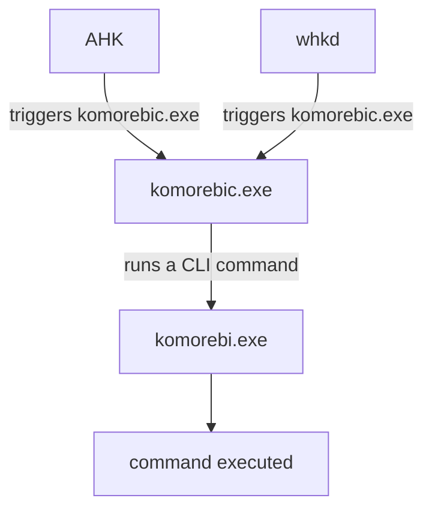
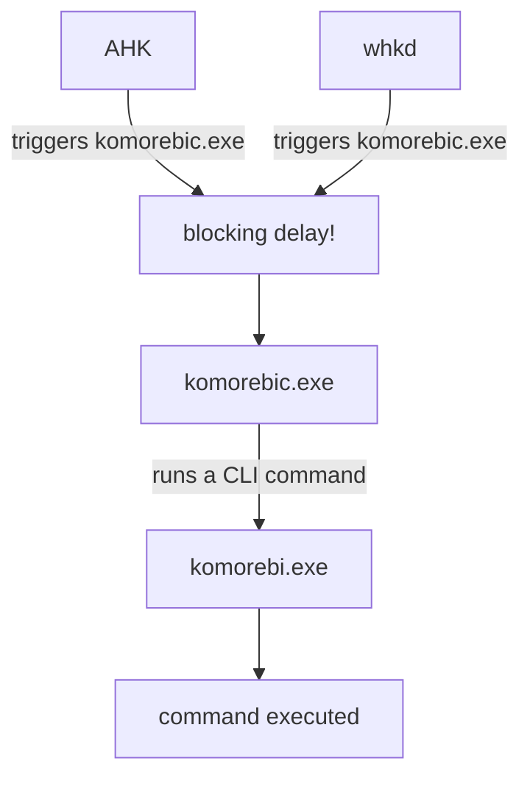

# Komorebic Service

If you are having delay issues about executing commands you can use `komorebic-service` feature of Komorebi which will limit some functionality (some commands won't be available) but it will most likely to fix your problem.

> Commands that are not directly related with window management isn't currently supported by `komorebic-service`. And probably you won't need them inside your hotkey config (AHK, whkd).

Delay issues with commands usually happens due to few known reasons:

- Kernel based anticheat softwares. (Faceit AC, Vanguard etc.)
- Kernel based antivirus softwares.
- Softwares that scans new process spawns.

There might be also some other reasons why this can happen too.

View the issue here for an example case to compare your own case: [Komorebi Fails to Execute Commands on Time (delayed execution up to 10-15sec)](https://github.com/LGUG2Z/komorebi/issues/1543)

### FAQ & Why This Happens

Well there might be different causes that might trigger the "delayed execution" issue but probably you have a software that scans new process spawn on your machine, the way `komorebic` works is different than `komorebic-service`.

`komorebic` works by running a CLI command and directing the args to the actual `komorebi.exe` which will take the arguments from CLI command and do what it needs to does, such as moving windows etc.

And because (doesn't matter if you use `whkd` or `AHK`) you spawn new `komorebic.exe` every time you run the CLI command `komorebic` (or `komorebic.exe`) that suspected software will freeze the komorebi completely until it finishes the checks it's doing, when it's done everything will be back and working/executing as expected.

Delayed executions can be up to 10, 15, 20 seconds time to time, I'm still not sure what is the underlying issue that is directly related with the duration of delay time.

Other than "long" delays average execution time of any `komorebic` command may increase over time too, for example you might see that `komorebic` getting slower over time, which is another known issue but I don't know how this happens and what is the root cause of this. It's also veyr likely that you will have more delay than before, even if it won't go up over time, which as I said reason of this is probably the anticheat or antivirus software you have installed.

> The key take here is komorebi isn't slow to respond or render something, the actual problem is `komrobic.exe` is blocked to execute the command at all, this is why things are delayed, not because komorebi itself is slow that isn't the case. (It's written in Rust it can't be slow xd)

Example of what happens in normal case;



Example of what happens in delayed case;



### How to Fix

You have few options to fix this issue permanently or temporarily.

1. You can keep `komorebic log` openin a terminal session.
2. You can uninstall anticheat or antivirus software.
3. You can use `komorebic-service` instead of `komorebic`.

When you run `komorebic log` command on your terminal sometimes it fixes the issue but you will see some increased CPU usage (%2-8) which something you may not want. But can be quick fix temporarily if it works.

You can remove some known anticheat/antivirus softwares but this might not help too, because as far as I find out just single install of these softwares sometimes enough to break Komorebi forever, probably due to kernel things I don't understand. So you can try this but might not help too.

> Windows Defender usually works fine you shouldn't have any issue with Windows Defender, just let you know. You can also whitelist `komorebic.exe` if you think Windows Defender is causing issues. [how to whitelist](https://learn.microsoft.com/en-us/answers/questions/3187645/how-to-add-an-exception-to-windows-defender)

**None of the solutions above is %100 fix**, it may work or not. If you want to permanently fix the issue you should switch to `komorebic-service` which doesn't spawn any new process but instead keeps running in the background while Komorebi is running.

For AHK replace your `Komorebic` function with the following command;

```ahkv2
Komorebic(command) {
    static PIPE_NAME := "\\.\pipe\komorebi-command"

    ; Retry up to 3 times if pipe is busy
    loop 3 {
        try {
            pipe := FileOpen(PIPE_NAME, "w", "UTF-8-RAW")
            if (pipe) {
                pipe.Write(command)
                pipe.Close()
                return
            }
        } catch as e {
            OutputDebug("Komorebi pipe error: " . e.Message)
        }
    }
}
```

After this you can leave your commands as they are. This will change how Komorebi handles your commands, instead of running CLI commands now Komorebi will use pipes to communicate with your hotkey software (AHK or whkd).

```
ahk or whkd -> komorebic-service (via pipes) -> komorebi
```

No process spawns, no antivirus or anticheat software scans, or similar issues that has the similar root causes.

This should fix your delayed execution issue.

### Starting `komorebic-service`

This can be done by adding the `--service` flag when you are starting Komorebi, but it won't your if `komorebic-service.exe` isn't in the PATH, if it didn't work add it to PATH.

Example:

```bash
# Starts `komorebic-service` too. 
komorebic-no-console.exe start --ahk --bar --service
```

#### Fixing PATH

For scoop:

1. Go to `C:\Users\%USERNAME%\scoop\apps\komorebi\current`
2. Copy `komorebic-service.exe` file.
3. Go to `C:\Users\%USERNAME%\scoop\shims`
4. Paste file into shims directory.

For winget:

Add `C:\Program Files\komorebi\bin` to your PATH.

---

If you are still having delay issues you may need to reset your PC, or maybe there is something much more weird that causes delays.