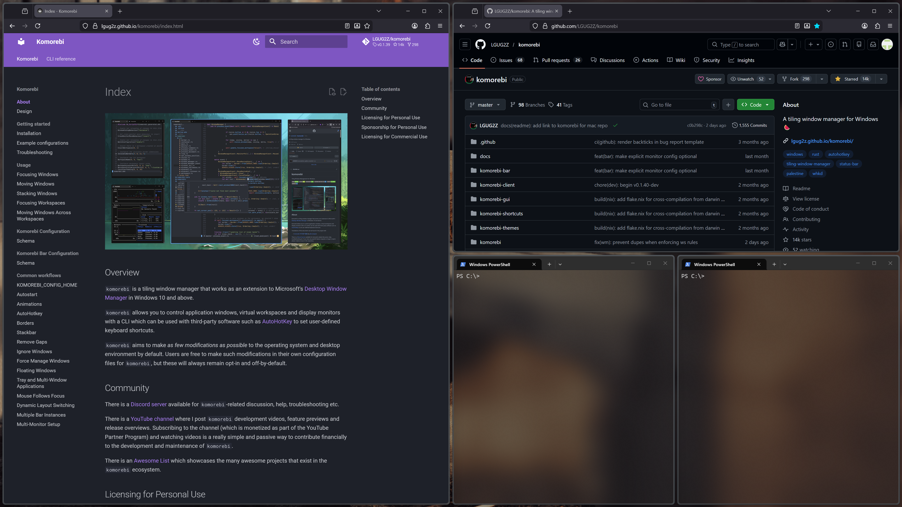
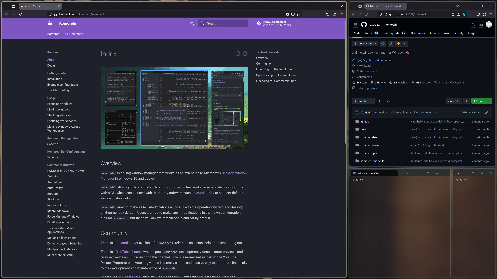

# Layout Ratios

With `komorebi` you can customize the split ratios for various layouts using
`column_ratios` and `row_ratios` in the `layout_options` configuration.

## Before and After

BSP layout example:

**Before** (default 50/50 splits):



**After** (with `column_ratios: [0.7]` and `row_ratios: [0.6]`):



## Configuration

```json
{
  "monitors": [
    {
      "workspaces": [
        {
          "name": "main",
          "layout_options": {
            "column_ratios": [0.3, 0.4],
            "row_ratios": [0.4, 0.3]
          }
        }
      ]
    }
  ]
}
```

You can specify up to 5 ratio values (defined by `MAX_RATIOS` constant). Each value should be between 0.1 and 0.9
(defined by `MIN_RATIO` and `MAX_RATIO` constants). Values outside this range are automatically clamped.
Columns or rows without a specified ratio will share the remaining space equally.

## Usage by Layout

| Layout | `column_ratios` | `row_ratios` |
|--------|-----------------|--------------|
| **Columns** | Width of each column | - |
| **Rows** | - | Height of each row |
| **Grid** | Width of each column (rows are equal height) | - |
| **BSP** | `[0]` as horizontal split ratio | `[0]` as vertical split ratio |
| **VerticalStack** | `[0]` as primary column width | Stack row heights |
| **RightMainVerticalStack** | `[0]` as primary column width | Stack row heights |
| **HorizontalStack** | Stack column widths | `[0]` as primary row height |
| **UltrawideVerticalStack** | `[0]` center, `[1]` left column | Tertiary stack row heights |

## Examples

### Columns Layout with Custom Widths

Create 3 columns with 30%, 40%, and 30% widths:

```json
{
  "layout_options": {
    "column_ratios": [0.3, 0.4]
  }
}
```

Note: The third column automatically gets the remaining 30%.

### Rows Layout with Custom Heights

Create 3 rows with 20%, 50%, and 30% heights:

```json
{
  "layout_options": {
    "row_ratios": [0.2, 0.5]
  }
}
```

Note: The third row automatically gets the remaining 30%.

### Grid Layout with Custom Column Widths

Grid with custom column widths (rows within each column are always equal height):

```json
{
  "layout_options": {
    "column_ratios": [0.4, 0.6]
  }
}
```

Note: The Grid layout only supports `column_ratios`. Rows within each column are always
divided equally because the number of rows per column varies dynamically based on window count.

### VerticalStack with Custom Ratios

Primary column takes 60% width, and the stack rows are split 30%/70%:

```json
{
  "layout_options": {
    "column_ratios": [0.6],
    "row_ratios": [0.3]
  }
}
```

Note: The second row automatically gets the remaining 70%.

### HorizontalStack with Custom Ratios

Primary row takes 70% height, and the stack columns are split 40%/60%:

```json
{
  "layout_options": {
    "row_ratios": [0.7],
    "column_ratios": [0.4]
  }
}
```

Note: The second column automatically gets the remaining 60%.

### UltrawideVerticalStack with Custom Ratios

Center column at 50%, left column at 25% (remaining 25% goes to tertiary stack),
with tertiary rows split 40%/60%:

```json
{
  "layout_options": {
    "column_ratios": [0.5, 0.25],
    "row_ratios": [0.4]
  }
}
```

Note: The second row automatically gets the remaining 60%.

### BSP Layout with Custom Split Ratios

Use separate ratios for horizontal (left/right) and vertical (top/bottom) splits:

```json
{
  "layout_options": {
    "column_ratios": [0.6],
    "row_ratios": [0.3]
  }
}
```

- `column_ratios[0]`: Controls all horizontal splits (left window gets 60%, right gets 40%)
- `row_ratios[0]`: Controls all vertical splits (top window gets 30%, bottom gets 70%)

Note: BSP only uses the first value (`[0]`) from each ratio array. This single ratio is applied
consistently to all splits of that type throughout the layout. Additional values in the arrays are ignored.

## Notes

- Ratios are clamped between 0.1 and 0.9 (prevents zero-sized windows and ensures space for other windows)
- Default ratio is 0.5 (50%) when not specified, except for UltrawideVerticalStack secondary column which defaults to 0.25 (25%)
- Ratios are applied **progressively** - a ratio is only used when there are more windows to place after the current one
- The **last window always takes the remaining space**, regardless of defined ratios
- **Ratios that would sum to 100% or more are automatically truncated** at config load time to ensure there's always space for additional windows
- Unspecified ratios default to sharing the remaining space equally
- You only need to specify the ratios you want to customize; trailing values can be omitted

## Progressive Ratio Behavior

Ratios are applied progressively as windows are added. For example, with `row_ratios: [0.3, 0.5]` in a VerticalStack:

| Windows in Stack | Row Heights |
|------------------|-------------|
| 1 | 100% |
| 2 | 30%, 70% (remainder) |
| 3 | 30%, 50%, 20% (remainder) |
| 4 | 30%, 50%, 10%, 10% (remainder split equally) |
| 5 | 30%, 50%, 6.67%, 6.67%, 6.67% |

## Automatic Ratio Truncation

When ratios sum to 100% (or more), they are automatically truncated at config load time.

For example, if you configure `column_ratios: [0.4, 0.3, 0.3]` (sums to 100%), the last ratio (0.3) is automatically removed, resulting in effectively `[0.4, 0.3]`. This ensures there's always remaining space for the last window.

| Configured Ratios | Effective Ratios | Reason |
|-------------------|------------------|--------|
| `[0.3, 0.4]` | `[0.3, 0.4]` | Sum is 0.7, below 1.0 |
| `[0.4, 0.3, 0.3]` | `[0.4, 0.3]` | Sum would be 1.0, last ratio truncated |
| `[0.5, 0.5]` | `[0.5]` | Sum would be 1.0, last ratio truncated |
| `[0.6, 0.5]` | `[0.6]` | Sum would exceed 1.0, last ratio truncated |

This ensures the layout always fills 100% of the available space and new windows are never placed outside the visible area.
